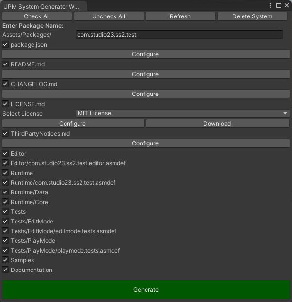
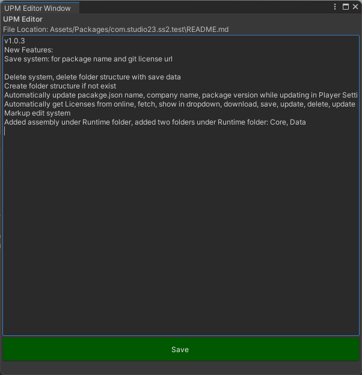
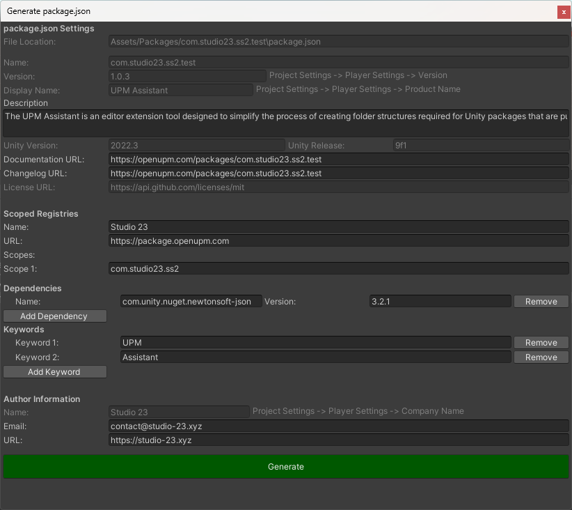

# Unity Package Manager Assistant

The UPM Assistant is an editor extension tool designed to simplify the process of creating folder structures required for Unity packages that are published on https://openupm.com/. This tool automates the generation of the necessary directory hierarchy, ensuring that package assets are organized correctly and adhere to the standards of Unity's package management system. This tool also allows users to generate and customize package.json files, facilitating seamless publishing on the platforms






## Table of Contents

1. [Installation](#installation)
2. [Usage](#usage)
   - [Automated Folder Structure Creation](#Automated Folder Structure Creation)
   - [Customization package.json](#Customization package.json)

3. [Example](#example)
4. [License](#license)

## Installation

### Install via Git URL
You can also use the "Install from Git URL" option from Unity Package Manager to install the package.
```
https://github.com/Studio-23-xyz/UPMAssistant.git#upm
```
## Usage

### Automated Folder Structure Creation


This tool automatically generates the necessary directories, including 'Editor', 'Runtime', 'Tests', and other essential folders, ensuring the package structure aligns with Unity's guidelines.

This system will automatically created Asset Definaton for the system.

You can create Tests asset from this system.

To create the automated folder structure, navigate to UPM -> UPM System Generator. A popup editor window will open; enter your package name, select the necessary files/folders from the left radio buttons, and click on the 'Generate' button to create your folder directory along with the mentioned files.

* **Delete** : Using this system you can delete your existence or created System. 
* **Refresh** : You can refresh any existence path using refresh button from the system generator.

### Customizing package.json


This Package Creator allows users to customize the package.json file, including essential details such as package name, version, description, and dependencies. This customization ensures that packages are accurately represented and easily understandable.

To create or update manifest.json, navigate to UPM -> Generate manifest.json. A popup window will open; enter your necessary information and click on the 'Generate' button at the bottom of the window.


*Before customization package.json, generate folder structure from UPM System Generator*
 
 
